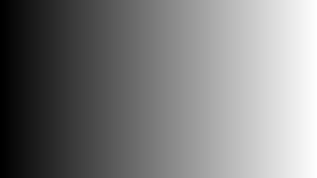
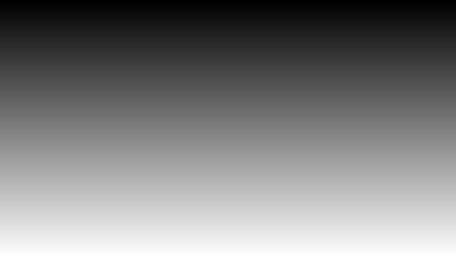

Fill
====


Creates a new image with the same dimensions as a source image, setting each pixel to the specified colour.

In addition to the colour, the function accepts a _Painter_ which can be used to apply a gradient.


### Examples

Using this image as our input:


```kotlin
// a new image with all pixels blue, and the dimensions
// taken from the source image
image.fill(Color.BLUE)
```


```kotlin
// a new image with the pixels coloured from the given vertical gradient.
image.fill(LinearGradient.vertical(Color.BLACK, Color.WHITE))
```




```kotlin
// a new image with the pixels coloured from the given horizontal gradient
image.fill(LinearGradient.horizontal(Color.BLACK, Color.WHITE))
```



