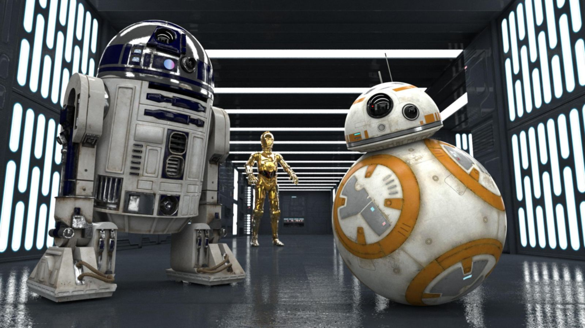

Scale
=====

Scales an image up or down. This operation will change both the canvas and the image.
This is what most people want when they think of "resizing" an image.

If instead, we wish to change the image "canvas" without scaling up or down, then [resize](resize.md) is the right operation.

We can perform a scale operation with a specified width and height. Or we can specify only a width or height
and Scrimage will adjust the other dimension to keep the aspect ratio constant.

Alternatively, we can specify a scale factor, which will multiply the width and height by that factor.


### Examples

Using this image as our input:


```kotlin
image.scaleToWidth(400) // keeps aspect ratio
```


```kotlin
image.scaleToHeight(200) // keeps aspect ratio
```


```kotlin
image.scaleTo(400, 400)
```


```kotlin
// using the fast scale method
image.scaleTo(400, 400, ScaleMethod.FastScale)
```


```kotlin
image.scale(0.5) // keeps aspect ratio, applies factor to width and height
```


### Scale Algorithms

Each scale operation has a `ScaleMethod` parameter that allows us to specify the algorithm to be used when
performing the scale. Options are `FastScale`, `Lanczos3`, `BSpline`, `Bilinear`, `Bicubic`. Bicucbic is the default.

Here is the same image scaled using each of the algorithms. Click on the image to see the full size.

*Fast Scale*

[](images/scale_fast_scale.jpg)

*BSpline*

[](images/scale_bspline.jpg)

*Lanczos3*

[](images/scale_lanczos3.jpg)

*Bilinear*

[](images/scale_bilinear.jpg)

*Bicubic*

[](images/scale_bicubic.jpg)

